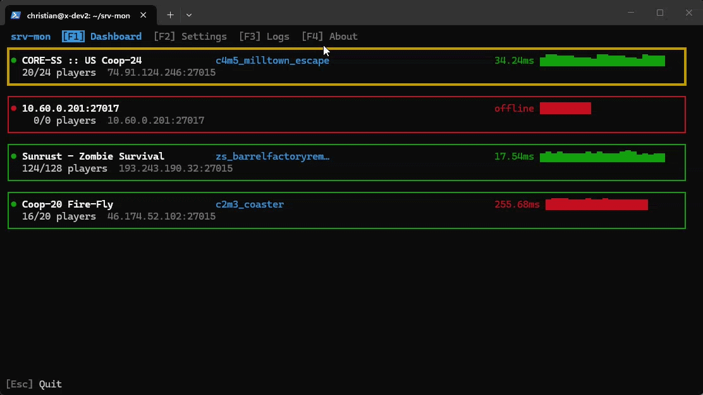

A tool that allows you to monitor game servers inside a terminal. It provides real-time updates on server status, user list, and also monitors latency to the server which supports multiple types of query/packet types (e.g., server queries or ICMP). Will be supporting RCON commands in the future as well!



🛑 Project **NOT finished** and a work in progress! Basic functionality should work, though. **Only** A2S game server queries are supported **at this time**.  
⚠️ Project name is **subject to change**.

## Building & Installing
You will want to make sure you have Rust and Cargo installed. You can install them from [here](https://www.rust-lang.org/tools/install).

You can clone the project assuming you have `git` installed.

```bash
# Clone the repository
git clone https://github.com/gamemann/srv-mon-term.git

# Change directory to the project folder
cd srv-mon-term
```

By default, servers are stored using `sqlite` and you will need to have `libsqlite3-dev` installed on your system. You can install it using your package manager. For example, on Ubuntu/Debian you can use `apt`:

```bash
sudo apt install -y libsqlite3-dev
```

To **install** the project, you can use Cargo as well:

```bash
cargo install --path .
```

This should allow you to execute `srv-mon-term` from anywhere in your terminal (via the `$PATH`).

## Usage
In the future I plan on making it so you can do everything inside of the TUI, but for now you must rely on the command line to add servers to monitor along with some other functionality.

| Command | Description | Default |
|---------|-------------| ------- |
| `-s --store` | The storage type to use when persisting server settings. Currently, only `sqlite` is tested, but `json` will be supported in the future. | `sqlite` |
| `--store-path` | The path to the store file without the file extension since that's determined off of the storage type. | `~/.config/srv-mon-term/store` |
| `-b --basic` | Uses basic `stdout` messages instead of starting the TUI. Generally used for debugging or minimal output. | - |
| `-v --version` | Displays the current version of the program. | - |
| `-h --help` | Displays the help message. | - |

### General Settings
These are general settings that are stored in whatever store you specify. You can override these settings with command line arguments.

#### Logging
| Command | Description | Default |
|---------|-------------| ------- |
| `l --log` | The log levels to use. Separate multiple levels with a comma. Valid levels are `fatal`, `error`, `warn`, `info`, `debug`, and `trace`. | `info,warn,error,fatal` |
| `-L --log-path` | When specified, all log messages will be written to the specified file as well. Data formats are available! For example: `./logs/%Y-%m-%d.log` | - |
| `-B --log_max_buffer_size` | The maximum number of log messages to keep in the log buffer before popping out the last one. | `1000` |

#### TUI
| Command | Description | Default |
|---------|-------------| ------- |
| `-i --draw-interval` | The interval in milliseconds to redraw the TUI. | `500` |
| `-E --input-poll-interval` | The interval in milliseconds to poll for user input. | `500` |

### Server Settings
Here are general server settings for adding, deleting, or overriding server configurations.

| Command | Description |
|---------|-------------|
| `-d --dst` | The destination IP address or hostname of the server you want to monitor or add/delete. You may also specify a port using the format `IP:PORT`. |
| `-P -port` | The port of the server you want to monitor or add/delete. This is optional if you specify the port in the `--dst` option. |
| `-q --query` | The query type to use when monitoring or adding the server. Currently, only `A2S` queries are supported. If this option is not specified, the program will try to determine the query type based off of the port specified. |
| `-Q --query-port` | The port to use for the query. This is optional and will default to the port specified in `--dst` if not provided. |

##### Store Settings
| Command | Description |
|---------|-------------|
| `-S --save` | When set, adds or saves the server or setting to the store. This persists the server or setting for future sessions. |
| `-D --delete` | When set, deletes the server or setting from the store so it will no longer be monitored after the program exits. |

When deleting a server, **only** the destination address and port are required.

#### Overrides
You can specify overrides for a server when adding it to the store. These overrides will be saved and used whenever the server is monitored in the future.

| Command | Description |
|---------|-------------|
| `-t --timeout` | The query timeout in milliseconds. This is the amount of time the program will wait for a response from the server before considering it **Offline**. |

## Monitor Settings
You can change how the program monitors servers with the following commands.

| Command | Description |
|---------|-------------|
| `--query-monitor -M` | When set, will only monitor this specific query from the server. The values for this are `info`, `users`, and `vars`. If this option is not set, the program will monitor all queries. |
| `-m --monitor-only` | When set, will only monitor the server query specified above. |
| `-I --isolate` | When set, will only monitor the server specified through the command line. 